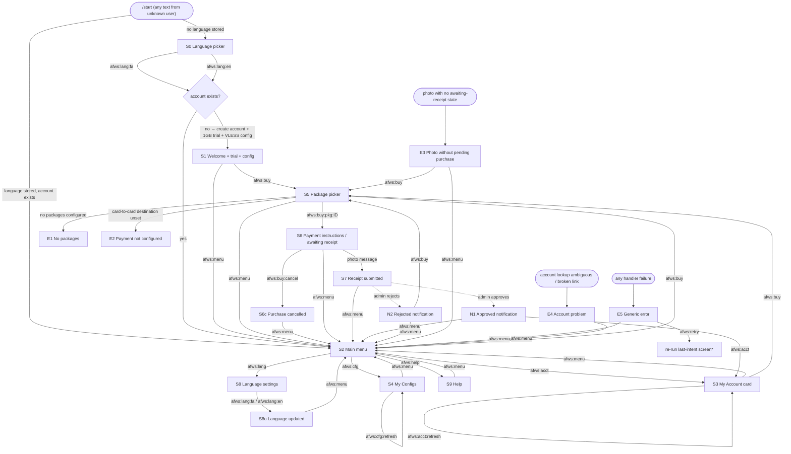
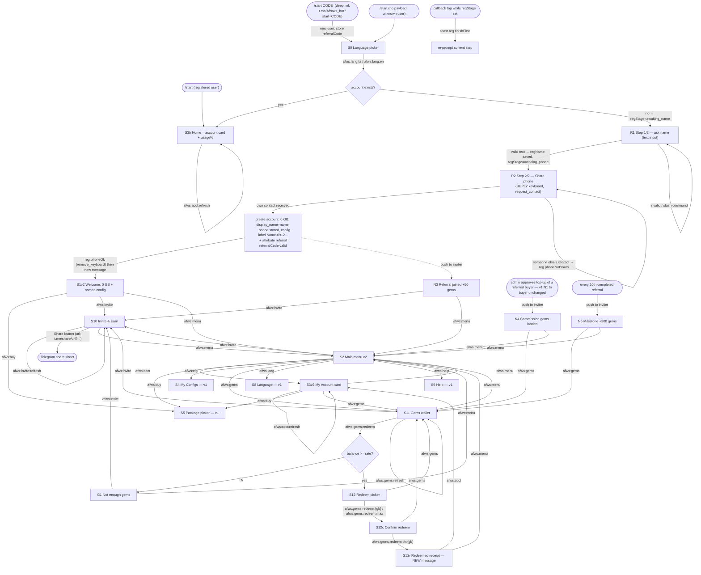

# afroWS Telegram Bot — Conversational Flow Design (`@Afrows_bot`)

**Owner:** Bot Experience Design. **Implements against:** `docs/telegram-self-service-plan.md`.
**Status:** Design contract for the backend engineer. This document defines the *entire* user-facing
surface of the bot: screens, inline-keyboard layouts, callback-data keys, bilingual copy
(Persian + English) keyed by string id, and the per-user persisted state. The backend must not
invent user-facing strings or button layouts outside this spec.

> **v2:** §§1–8 below are the shipped v1 contract. The **v2 extension** (registration replaces the
> free trial, deep-link referrals, Invite & Earn, gems wallet, usage% home) starts at
> [§9 — v2 extension](#9-v2-extension--registration-invite--earn-gems-usage) and supersedes the
> v1 screens it explicitly marks as **retired**. Source of decisions:
> `docs/telegram-bot-v2-plan.md` (LOCKED section).

Design principles (from the role brief):

- **Menu-driven.** Every screen is reachable by tapping inline-keyboard buttons. Slash commands
  (`/start`, `/menu`, `/charge`, `/status`, `/quota`, `/usage`, `/help`) remain as shortcuts only.
- **Low friction.** A brand-new user reaches a working, copyable VLESS config in **two taps**
  (`/start` → language button → welcome screen with config).
- **Bilingual parity.** Every string exists in Persian (`fa`) and English (`en`). Persian is
  first-class: natural phrasing, RTL-correct rendering (see §7).
- **No dead ends.** Every screen — including every error/empty state — has a button that returns
  to the main menu.
- **One primary action per screen.** Secondary actions (back/cancel) are visually last.

---

## 1. Flow diagram

Edge labels are the exact `callback_data` values (namespace `afws:` — see §6.1) or the
message-type trigger (`/start`, `photo`, admin action).



\* `afws:retry` re-renders the screen the user was trying to reach; if the bot cannot determine it
(stateless nav), it renders S2. See §6.1.

Slash-command shortcuts map onto the same screens: `/menu` → S2, `/status` and `/usage` → S3,
`/quota` → S3, `/charge` → S5, `/help` → S9, `/language` → S8. An unknown command renders S9
(Help) prefixed with `error.unknownCommand`.

---

## 2. Screen-by-screen spec

Conventions used below:

- Message text is given by **copy id** (full bilingual text in §4). `{placeholders}` are
  interpolated by the backend (list in §6.4).
- Keyboard layouts are written row by row; each button is `label-copy-id → callback_data`.
- On `callback_query`, the backend must always `answerCallbackQuery` (empty, or with the toast
  noted per screen) and should **edit the originating message** (`editMessageText`) for
  navigation between S2–S9/E-screens, so the chat stays tidy. S1, S7, N1, N2 are **new**
  messages (they must persist in chat history: the config and the receipts trail).

### S0 — Language picker

Shown when a user with no stored `language` sends anything (including bare `/start`).
The prompt itself is bilingual (the only intentionally mixed-language message).

- Text: `lang.prompt`
- Keyboard:
  - Row 1: `lang.btn.fa → afws:lang:fa` | `lang.btn.en → afws:lang:en`

On tap: persist `language`, then — if no account is linked to this `telegram_id` — create the
self-service account (1 GB trial + VLESS config, idempotent per plan) and render **S1**;
otherwise render **S2**.

### S1 — Welcome + instant trial + config (new users only)

Sent as a **new message** (never edited away — the user must be able to scroll back to their
config). `parse_mode: HTML`; the config link is wrapped in `<code>…</code>` so a single tap
copies it in Telegram.

- Text: `welcome.new` (contains `{trialQuota}` and the `<code>{configLink}</code>` block)
- Keyboard:
  - Row 1: `buy.btn.open → afws:buy`
  - Row 2: `common.btn.menu → afws:menu`

If account creation succeeds but the config link cannot be generated, send `welcome.newNoConfig`
with the same keyboard plus Row 1 prepended: `cfg.btn.open → afws:cfg` (so the user can retry
fetching configs).

### S2 — Main menu

The hub. Rendered on `/start` for known users (with `welcome.back` as the text), on `/menu`,
and via every `afws:menu` button (with `menu.title` as the text).

- Text: `welcome.back` (on `/start`) or `menu.title` (all other entries)
- Keyboard (2-2-1... layout, primary actions on top):
  - Row 1: `menu.btn.account → afws:acct` | `menu.btn.buy → afws:buy`
  - Row 2: `menu.btn.configs → afws:cfg`
  - Row 3: `menu.btn.lang → afws:lang` | `menu.btn.help → afws:help`

### S3 — My Account card

At-a-glance status. `{status}` is itself localized via the `status.*` copy ids.
Quota lines: if the account is unlimited, use `acct.quotaUnlimited` in place of
`acct.quotaLine`.

- Text: `acct.card` (placeholders: `{status}`, `{remaining}`, `{total}`, `{used}`,
  `{activeClients}`, `{clientCount}`; if the account has an expiry, append `acct.expiryLine`
  with `{expiresAt}`)
- Keyboard:
  - Row 1: `common.btn.refresh → afws:acct:refresh`
  - Row 2: `menu.btn.buy → afws:buy`
  - Row 3: `common.btn.menu → afws:menu`

`afws:acct:refresh` re-fetches and edits the message in place; `answerCallbackQuery` toast:
`common.toast.refreshed`. If the content is unchanged (Telegram rejects no-op edits), only the
toast is shown.

### S4 — My Configs

Lists every active client config, each entry link in its own `<code>` block (tap-to-copy),
prefixed by its protocol + label line `cfg.itemHeader`. Keep total message under ~3500 chars;
if configs would overflow, paginate is **out of scope for v1** — truncate at 5 configs and
append `cfg.truncated`.

- Text: `cfg.title` + repeated `cfg.itemHeader` + `<code>{configLink}</code>` per config,
  then `cfg.importHint`
- Empty state (no configs): text `cfg.empty` instead, same keyboard.
- Keyboard:
  - Row 1: `common.btn.refresh → afws:cfg:refresh`
  - Row 2: `common.btn.menu → afws:menu`

### S5 — Buy Data: package picker

Packages come from the `volume_packages` catalog, sorted by size ascending, one button per row
(full-width tap targets; package names can be long in Persian).

- Text: `buy.pickPackage`
- Keyboard:
  - Rows 1..N (max 8 packages; if more exist, show the 8 smallest): each
    `buy.pkgBtn` (template `{size} — {price}`) `→ afws:buy:pkg:{volumePackageId}`
  - Last row: `common.btn.menu → afws:menu`

Pre-checks, in order:
1. No packages configured → render **E1** instead.
2. Card-to-card destination unset in settings → render **E2** instead (fail *before* the user
   picks a package, not after).

If the user already has an `awaiting_receipt` purchase in progress, render **S6** directly
(resuming it) with line `buy.resumeNote` prepended. If the user has a submitted-but-unreviewed
request, still allow a new purchase but prepend `buy.pendingApprovalNote` (`{requestId}`) to S5.

### S6 — Payment instructions / awaiting receipt

Entered from `afws:buy:pkg:{id}`. The backend persists the in-progress charge
(§5) before rendering. Card number must be ASCII digits grouped in 4s
(`6037 9911 2233 4455`) on its own line inside `<code>` (tap-to-copy).

- Text: `buy.payment` (placeholders: `{packageSize}`, `{amount}`,
  `<code>{cardNumber}</code>`, `{cardHolder}`)
- Keyboard:
  - Row 1: `buy.btn.cancel → afws:buy:cancel`
  - Row 2: `common.btn.menu → afws:menu`

Behavior notes:
- `afws:menu` does **not** cancel the in-progress charge — the user may pay first and send the
  photo later. The charge stays valid for **24 h** (`AWAITING_RECEIPT_TTL`), after which a photo
  falls through to **E3**.
- `afws:buy:cancel` clears the in-progress charge, edits the message to `buy.cancelled` with
  keyboard Row 1: `buy.btn.open → afws:buy`, Row 2: `common.btn.menu → afws:menu`, and toasts
  `buy.toast.cancelled`.
- A **document**-type image (file, not photo) while awaiting receipt → reply `buy.needPhoto`
  (keep the state; same keyboard as S6).
- Text messages while awaiting receipt are answered normally (commands/menu still work); the
  state persists.

### S7 — Receipt submitted

Triggered by a `photo` message while an `awaiting_receipt` charge exists. Backend creates the
`telegram_topup_requests` row (status `pending`, storing the largest `photo` size's `file_id`),
clears the in-progress state, then sends this as a **new message**.

- Text: `buy.submitted` (placeholder: `{requestId}`)
- Keyboard:
  - Row 1: `common.btn.menu → afws:menu`

### N1 — Approved notification (pushed on admin approve)

New message pushed to the user's `telegram_chat_id`, in the user's stored language.

- Text: `notify.approved` (placeholders: `{requestId}`, `{packageSize}`)
- Keyboard:
  - Row 1: `menu.btn.account → afws:acct`
  - Row 2: `common.btn.menu → afws:menu`

### N2 — Rejected notification (pushed on admin reject)

- Text: `notify.rejected` (placeholders: `{requestId}`, `{reason}` — the admin's review note;
  if empty, substitute `notify.noReason`)
- Keyboard:
  - Row 1: `buy.btn.retry → afws:buy`
  - Row 2: `common.btn.menu → afws:menu`

### S8 — Language settings

- Text: `lang.settings` (mentions the current language)
- Keyboard:
  - Row 1: `lang.btn.fa → afws:lang:fa` | `lang.btn.en → afws:lang:en`
  - Row 2: `common.btn.menu → afws:menu`

On tap: persist, edit message to `lang.updated` (rendered **in the newly chosen language**)
with keyboard Row 1: `common.btn.menu → afws:menu`. Toast: `lang.toast`.

### S9 — Help

- Text: `help.body` (placeholder: `{supportContact}`, from settings; if unset, drop the
  support line)
- Keyboard:
  - Row 1: `menu.btn.buy → afws:buy` | `menu.btn.account → afws:acct`
  - Row 2: `common.btn.menu → afws:menu`

### Error / empty states

Every error screen keeps the user one tap from the menu.

| Id | Trigger | Text | Keyboard |
|----|---------|------|----------|
| **E1** No packages | S5 entry, empty catalog | `error.noPackages` | Row 1: `common.btn.menu → afws:menu` |
| **E2** Payment not configured | S5/S6 entry, card-to-card setting unset | `error.cardUnset` | Row 1: `common.btn.menu → afws:menu` |
| **E3** Photo without pending purchase | `photo` received, no `awaiting_receipt` state (or state expired) | `error.photoNoCharge` | Row 1: `buy.btn.open → afws:buy` · Row 2: `common.btn.menu → afws:menu` |
| **E4** Account problem | linked-account lookup returns `ambiguous`, or account row is missing/broken for a known telegram id | `error.accountProblem` | Row 1: `common.btn.menu → afws:menu` |
| **E5** Generic / network error | any unexpected failure while building a reply | `error.generic` | Row 1: `common.btn.retry → afws:retry` · Row 2: `common.btn.menu → afws:menu` |
| **E6** Unknown command | unrecognized slash command | `error.unknownCommand` + `help.body` | as S9 |
| **E7** Stale button | `callback_query` with unknown/retired data, or acting on an outdated message | toast `error.staleButton` (via `answerCallbackQuery` only, `show_alert: false`), then send S2 | — |

---

## 3. Tap-count sanity check (low-friction goals)

- New user → working config: `/start` → 1 tap (language) → config on screen (copyable). **1 tap.**
- Any user → paid data: menu → Buy Data → package → pay → send photo. **2 taps + 1 photo.**
- Any screen → main menu: **1 tap.**

---

## 4. Bilingual copy table

Copy lives in a **typed i18n map** keyed by these ids (per `docs/multilingual-ui.md`: both
languages in one typed object so TypeScript catches gaps). `\n` marks line breaks.
`{placeholders}` are interpolated verbatim (see §6.4). HTML (`<b>`, `<code>`) is part of the
string; backend must send `parse_mode: 'HTML'` and escape interpolated values.

Persian conventions used below: warm, spoken-but-polite register («شما»), Persian digits in
prose via the number formatter, ASCII digits for card numbers / config links / request ids
(see §7).

| String id | English (`en`) | Persian (`fa`) |
|---|---|---|
| `lang.prompt` | Hi! 👋 Welcome to <b>afroWS</b>.\nPlease choose your language:\n\nسلام! 👋 به <b>afroWS</b> خوش آمدید.\nلطفاً زبان خود را انتخاب کنید: | *(same bilingual string — used before a language exists)* |
| `lang.btn.fa` | فارسی 🇮🇷 | فارسی 🇮🇷 |
| `lang.btn.en` | English 🇬🇧 | English 🇬🇧 |
| `lang.settings` | 🌐 Language\nYour current language is <b>English</b>. Pick a language: | 🌐 زبان\nزبان فعلی شما <b>فارسی</b> است. زبان مورد نظر را انتخاب کنید: |
| `lang.updated` | Language set to English. ✅ | زبان به فارسی تغییر کرد. ✅ |
| `lang.toast` | Language updated ✅ | زبان تغییر کرد ✅ |
| `welcome.new` | 🎉 You're in!\nYour afroWS account is ready, with a free <b>{trialQuota}</b> trial already loaded.\n\nHere's your VLESS config — tap it once to copy:\n<code>{configLink}</code>\n\nImport it into your VPN app (e.g. v2rayNG or Streisand) and connect.\nWhen you need more data, tap <b>Buy Data</b> below. | 🎉 خوش آمدید!\nحساب afroWS شما ساخته شد و <b>{trialQuota}</b> حجم هدیه هم برایتان فعال است.\n\nاین کانفیگ VLESS شماست — یک بار رویش بزنید تا کپی شود:\n<code>{configLink}</code>\n\nآن را در اپ VPN خود (مثل v2rayNG یا Streisand) وارد کنید و وصل شوید.\nهر وقت حجم بیشتری خواستید، از دکمهٔ «خرید حجم» استفاده کنید. |
| `welcome.newNoConfig` | 🎉 You're in! Your afroWS account is ready with a free <b>{trialQuota}</b> trial.\nYour config is being prepared — tap <b>My Configs</b> in a moment to grab it. | 🎉 خوش آمدید! حساب afroWS شما با <b>{trialQuota}</b> حجم هدیه ساخته شد.\nکانفیگ شما در حال آماده‌سازی است — کمی بعد از «کانفیگ‌های من» آن را بردارید. |
| `welcome.back` | Welcome back! 👋 What would you like to do? | خوش برگشتید! 👋 چه کاری برایتان انجام دهیم؟ |
| `menu.title` | 🏠 Main menu — pick an option: | 🏠 منوی اصلی — یک گزینه را انتخاب کنید: |
| `menu.btn.account` | 👤 My Account | 👤 حساب من |
| `menu.btn.buy` | 🛒 Buy Data | 🛒 خرید حجم |
| `menu.btn.configs` | 🔗 My Configs | 🔗 کانفیگ‌های من |
| `menu.btn.lang` | 🌐 Language | 🌐 زبان |
| `menu.btn.help` | ❓ Help | ❓ راهنما |
| `acct.card` | 👤 <b>Your account</b>\nStatus: {status}\n{quotaLine}\nUsed: {used}\nActive configs: {activeClients}/{clientCount} | 👤 <b>حساب شما</b>\nوضعیت: {status}\n{quotaLine}\nمصرف‌شده: {used}\nکانفیگ‌های فعال: {activeClients} از {clientCount} |
| `acct.quotaLine` | Data left: <b>{remaining}</b> of {total} | حجم باقی‌مانده: <b>{remaining}</b> از {total} |
| `acct.quotaUnlimited` | Data: Unlimited | حجم: نامحدود |
| `acct.expiryLine` | Expires: {expiresAt} | تاریخ انقضا: {expiresAt} |
| `status.active` | Active ✅ | فعال ✅ |
| `status.suspended` | Suspended ⏸ | معلق ⏸ |
| `status.expired` | Expired ⌛ | منقضی ⌛ |
| `status.disabled` | Disabled 🚫 | غیرفعال 🚫 |
| `cfg.title` | 🔗 <b>Your configs</b>\nTap any config once to copy it: | 🔗 <b>کانفیگ‌های شما</b>\nروی هر کانفیگ یک بار بزنید تا کپی شود: |
| `cfg.itemHeader` | • {protocol} — {label} | • {protocol} — {label} |
| `cfg.importHint` | Import the copied link into your VPN app (e.g. v2rayNG) and connect. | لینک کپی‌شده را در اپ VPN خود (مثل v2rayNG) وارد کنید و وصل شوید. |
| `cfg.truncated` | …and more. Contact support to see the rest. | …و موارد دیگر. برای دیدن بقیه با پشتیبانی در تماس باشید. |
| `cfg.empty` | You don't have any configs yet. 🙈\nBuy a data package and we'll set one up for you right away. | هنوز کانفیگی ندارید. 🙈\nیک بستهٔ حجمی بخرید تا بلافاصله برایتان بسازیم. |
| `cfg.btn.open` | 🔗 My Configs | 🔗 کانفیگ‌های من |
| `buy.btn.open` | 🛒 Buy Data | 🛒 خرید حجم |
| `buy.pickPackage` | 🛒 <b>Buy Data</b>\nPick a package — you'll get the payment details next: | 🛒 <b>خرید حجم</b>\nیک بسته را انتخاب کنید — در مرحلهٔ بعد اطلاعات پرداخت را می‌بینید: |
| `buy.pkgBtn` | {size} — {price} | {size} — {price} |
| `buy.pendingApprovalNote` | ℹ️ Your previous request #{requestId} is still awaiting approval. | ℹ️ درخواست قبلی شما (شمارهٔ {requestId}) هنوز در انتظار تأیید است. |
| `buy.resumeNote` | ℹ️ You have an unfinished purchase — here are the payment details again: | ℹ️ یک خرید نیمه‌تمام دارید — این هم دوبارهٔ اطلاعات پرداخت: |
| `buy.payment` | 🧾 <b>Order:</b> {packageSize} — <b>{amount}</b>\n\nPlease transfer card-to-card to:\n💳 <code>{cardNumber}</code>\nName: <b>{cardHolder}</b>\n\nThen send a <b>photo of the receipt</b> right here. 📸\nOnce an admin approves it, the data is added to your account. | 🧾 <b>سفارش:</b> {packageSize} — <b>{amount}</b>\n\nلطفاً مبلغ را کارت‌به‌کارت واریز کنید:\n💳 <code>{cardNumber}</code>\nبه نام: <b>{cardHolder}</b>\n\nسپس <b>عکس رسید</b> را همین‌جا بفرستید. 📸\nبعد از تأیید مدیر، حجم به حساب شما اضافه می‌شود. |
| `buy.needPhoto` | Please send the receipt as a <b>photo</b> (not a file), so we can review it. 📸 | لطفاً رسید را به‌صورت <b>عکس</b> بفرستید (نه فایل) تا بتوانیم بررسی‌اش کنیم. 📸 |
| `buy.submitted` | ✅ Got your receipt!\nRequest <b>#{requestId}</b> is submitted and awaiting admin approval.\nWe'll message you here as soon as it's reviewed. | ✅ رسید شما رسید!\nدرخواست <b>شمارهٔ {requestId}</b> ثبت شد و در انتظار تأیید مدیر است.\nبه‌محض بررسی، همین‌جا به شما خبر می‌دهیم. |
| `buy.cancelled` | Purchase cancelled. No worries — come back any time. 🙂 | خرید لغو شد. اشکالی ندارد — هر وقت خواستید دوباره سر بزنید. 🙂 |
| `buy.btn.cancel` | ❌ Cancel purchase | ❌ انصراف از خرید |
| `buy.btn.retry` | 🛒 Try again | 🛒 تلاش دوباره |
| `buy.toast.cancelled` | Purchase cancelled | خرید لغو شد |
| `notify.approved` | ✅ Request <b>#{requestId}</b> approved — <b>{packageSize}</b> has been added to your account. Enjoy! 🎉 | ✅ درخواست <b>شمارهٔ {requestId}</b> تأیید شد و <b>{packageSize}</b> به حساب شما اضافه شد. نوش جان! 🎉 |
| `notify.rejected` | ❌ Request <b>#{requestId}</b> was not approved.\nReason: {reason}\nIf you think this is a mistake, try again or contact support. | ❌ درخواست <b>شمارهٔ {requestId}</b> تأیید نشد.\nدلیل: {reason}\nاگر فکر می‌کنید اشتباهی پیش آمده، دوباره تلاش کنید یا با پشتیبانی در تماس باشید. |
| `notify.noReason` | Not specified | ذکر نشده |
| `help.body` | ❓ <b>How afroWS works</b>\n• <b>My Account</b> — your status and remaining data.\n• <b>Buy Data</b> — pick a package, pay card-to-card, send the receipt photo; an admin approves it and your data is added.\n• <b>My Configs</b> — your connection links, tap to copy.\n\nSupport: {supportContact} | ❓ <b>afroWS چطور کار می‌کند؟</b>\n• <b>حساب من</b> — وضعیت و حجم باقی‌ماندهٔ شما.\n• <b>خرید حجم</b> — یک بسته انتخاب کنید، کارت‌به‌کارت پرداخت کنید و عکس رسید را بفرستید؛ بعد از تأیید مدیر، حجم اضافه می‌شود.\n• <b>کانفیگ‌های من</b> — لینک‌های اتصال شما؛ با یک لمس کپی می‌شوند.\n\nپشتیبانی: {supportContact} |
| `common.btn.menu` | 🏠 Main menu | 🏠 منوی اصلی |
| `common.btn.refresh` | 🔄 Refresh | 🔄 به‌روزرسانی |
| `common.btn.retry` | 🔁 Try again | 🔁 تلاش دوباره |
| `common.toast.refreshed` | Updated ✅ | به‌روز شد ✅ |
| `error.noPackages` | No data packages are available right now. 🙏\nPlease check back a little later. | فعلاً بسته‌ای برای فروش موجود نیست. 🙏\nلطفاً کمی بعد دوباره سر بزنید. |
| `error.cardUnset` | Payments aren't set up yet. 🙏\nPlease try again later — we're on it. | پرداخت هنوز راه‌اندازی نشده است. 🙏\nلطفاً کمی بعد دوباره تلاش کنید — در حال آماده‌سازی هستیم. |
| `error.photoNoCharge` | Thanks for the photo — but there's no purchase in progress. 🤔\nStart one with <b>Buy Data</b>, then send the receipt. | ممنون از عکس — ولی خرید فعالی در جریان نیست. 🤔\nاول از «خرید حجم» شروع کنید، بعد رسید را بفرستید. |
| `error.accountProblem` | There's a problem with your account link. 😕\nPlease contact support so we can fix it for you. | مشکلی در اتصال حساب شما وجود دارد. 😕\nلطفاً با پشتیبانی در تماس باشید تا برایتان درستش کنیم. |
| `error.generic` | Something went wrong on our side. 😕\nPlease try again. | مشکلی از سمت ما پیش آمد. 😕\nلطفاً دوباره تلاش کنید. |
| `error.unknownCommand` | I didn't recognize that command — here's what I can do: | این دستور را نشناختم — این کارها از من برمی‌آید: |
| `error.staleButton` | This menu is outdated — sending a fresh one. | این منو قدیمی شده — منوی تازه فرستادیم. |

Notes for the implementer:

- `lang.prompt` is a single bilingual string (rendered identically for both language values;
  it is only ever shown pre-choice).
- `acct.card` composes `{quotaLine}` from `acct.quotaLine` or `acct.quotaUnlimited`, and
  `{status}` from the `status.*` ids — never raw enum values.
- `buy.pkgBtn` is a **button label template**; `{size}` like «۲۰ گیگابایت» / “20 GB”,
  `{price}` includes the localized currency word (e.g. «۹۰٬۰۰۰ تومان» / “90,000 Toman”).
- `notify.rejected` substitutes `notify.noReason` when the admin left no note.

---

## 5. Per-user state model

Everything the bot must remember lives in one row per Telegram user
(new table `telegram_bot_users` or equivalent — naming is the backend's call, fields are not):

| Field | Type | Meaning |
|---|---|---|
| `telegram_id` | text, PK | Telegram numeric user id |
| `chat_id` | text | last known private chat id (for push notifications N1/N2) |
| `language` | `'fa' \| 'en' \| null` | null → show S0 on next contact |
| `pending_package_id` | fk `volume_packages` nullable | the package of the in-progress charge |
| `pending_amount_minor` | int nullable | price snapshot at pick time |
| `pending_currency` | text nullable | currency snapshot |
| `pending_started_at` | timestamp nullable | for the 24 h `AWAITING_RECEIPT_TTL` |
| `updated_at` | timestamp | bookkeeping |

Derived state (no extra column): `awaiting_receipt` ⇔ `pending_package_id IS NOT NULL AND
pending_started_at > now() - 24h`.

State transitions:

```
(no row) --any message--> row created, language=null  → S0
language=null --afws:lang:*--> language set           → S1 (new account) or S2
idle --afws:buy:pkg:ID--> awaiting_receipt            → S6   (pending_* set)
awaiting_receipt --photo--> idle                      → S7   (pending_* cleared; topup row created: status=pending)
awaiting_receipt --afws:buy:cancel--> idle            → S6c  (pending_* cleared)
awaiting_receipt --24h elapse--> idle (lazy expiry)   → photo now yields E3
topup pending --admin approve--> (push N1)            (topup row: approved; quota credited)
topup pending --admin reject--> (push N2)             (topup row: rejected + review_note)
awaiting_receipt --afws:buy:pkg:ID2--> awaiting_receipt (pending_* overwritten — user changed their mind)
```

Navigation itself is **stateless**: every button's `callback_data` fully identifies the target
screen, so no "current screen" is persisted. The only session-like state is the pending charge
above. The submitted-receipt lifecycle lives in `telegram_topup_requests`
(per plan: `pending | approved | rejected`), not here.

Language resolution rule for **every** outgoing message, including admin-triggered pushes
(N1/N2): use `telegram_bot_users.language`; if somehow null, fall back to `fa`.

---

## 6. Backend contract

### 6.1 Callback-data namespace

All bot buttons use the `afws:` prefix (fits Telegram's 64-byte `callback_data` limit with
room to spare). Any `callback_query` whose data does not start with `afws:` or is not in this
table → **E7** (stale-button toast + fresh S2).

| `callback_data` | Meaning / renders |
|---|---|
| `afws:lang:fa` | set language to Persian → S1 (new) / S2 / `lang.updated` (from S8) |
| `afws:lang:en` | set language to English → same |
| `afws:menu` | render S2 |
| `afws:acct` | render S3 |
| `afws:acct:refresh` | re-fetch + edit S3 in place |
| `afws:cfg` | render S4 |
| `afws:cfg:refresh` | re-fetch + edit S4 in place |
| `afws:buy` | render S5 (or E1/E2/S6-resume per §2-S5) |
| `afws:buy:pkg:{id}` | `{id}` = `volume_packages.id` (ASCII, ≤ 32 chars) → persist pending charge, render S6 |
| `afws:buy:cancel` | clear pending charge → S6c |
| `afws:lang` | render S8 |
| `afws:help` | render S9 |
| `afws:retry` | re-render the screen whose handler failed if known, else S2 |

### 6.2 Copy-string ids (complete set)

`lang.prompt`, `lang.btn.fa`, `lang.btn.en`, `lang.settings`, `lang.updated`, `lang.toast`,
`welcome.new`, `welcome.newNoConfig`, `welcome.back`,
`menu.title`, `menu.btn.account`, `menu.btn.buy`, `menu.btn.configs`, `menu.btn.lang`, `menu.btn.help`,
`acct.card`, `acct.quotaLine`, `acct.quotaUnlimited`, `acct.expiryLine`,
`status.active`, `status.suspended`, `status.expired`, `status.disabled`,
`cfg.title`, `cfg.itemHeader`, `cfg.importHint`, `cfg.truncated`, `cfg.empty`, `cfg.btn.open`,
`buy.btn.open`, `buy.pickPackage`, `buy.pkgBtn`, `buy.pendingApprovalNote`, `buy.resumeNote`,
`buy.payment`, `buy.needPhoto`, `buy.submitted`, `buy.cancelled`, `buy.btn.cancel`,
`buy.btn.retry`, `buy.toast.cancelled`,
`notify.approved`, `notify.rejected`, `notify.noReason`,
`help.body`,
`common.btn.menu`, `common.btn.refresh`, `common.btn.retry`, `common.toast.refreshed`,
`error.noPackages`, `error.cardUnset`, `error.photoNoCharge`, `error.accountProblem`,
`error.generic`, `error.unknownCommand`, `error.staleButton`.

Type them as one map — `Record<CopyId, { en: string; fa: string }>` — per
`docs/multilingual-ui.md`, so a missing translation is a compile error.

### 6.3 Persisted fields

Per-user (see §5): `telegram_id`, `chat_id`, `language`, `pending_package_id`,
`pending_amount_minor`, `pending_currency`, `pending_started_at`, `updated_at`.
Plus the plan's `telegram_topup_requests` table (unchanged from
`docs/telegram-self-service-plan.md`).

### 6.4 Interpolation placeholders

`{trialQuota}`, `{configLink}`, `{status}`, `{quotaLine}`, `{remaining}`, `{total}`, `{used}`,
`{activeClients}`, `{clientCount}`, `{expiresAt}`, `{protocol}`, `{label}`, `{size}`,
`{price}`, `{packageSize}`, `{amount}`, `{cardNumber}`, `{cardHolder}`, `{requestId}`,
`{reason}`, `{supportContact}`.
All interpolated values must be HTML-escaped before substitution (config links, labels, and
admin-typed rejection reasons may contain `<`, `&`, etc.).

### 6.5 Required Telegram API capabilities (gaps vs. today's code)

The current `TelegramAlertService.sendMessage` (`apps/backend/src/notifications/telegram-alert.service.ts`)
sends plain text only, and `TelegramBotService.handleUpdate`
(`apps/backend/src/telegram/telegram-bot.service.ts`) handles only text `message` updates.
This design additionally requires (stated as UX-driven needs — implementation is the backend's):

1. `sendMessage` with `parse_mode: 'HTML'` and `reply_markup` (inline keyboard).
2. Handling `callback_query` updates: dispatch on `callback_data`, always `answerCallbackQuery`
   (with the per-screen toast where specified).
3. `editMessageText` for in-place navigation (S2–S9, E-screens) — fall back to sending a new
   message if the edit fails (e.g. message too old).
4. Handling `photo` messages (store largest size's `file_id`) and, for `document` images while
   awaiting receipt, replying `buy.needPhoto`.
5. Push messages to `chat_id` on admin approve/reject (N1/N2), localized via the stored
   `language`.

Never log or echo the bot token or the raw card number outside the intended payment message.

---

## 7. Persian / RTL rendering rules

1. **One language per message** (except `lang.prompt`). No mixed-language sentences.
2. **Directionality guard:** any Persian message line that *begins* with an emoji, Latin word,
   or digit must be prefixed with U+200F (RLM) by the render layer so Telegram lays the line
   out RTL. Lines beginning with a Persian letter need nothing.
3. **Digits:** Persian prose uses Persian digits via a locale formatter
   (`۲۰ گیگابایت`, `۹۰٬۰۰۰ تومان`, `۱٫۵ گیگابایت باقی‌مانده`). Always-ASCII exceptions —
   card number, config links, request id inside `#{requestId}` in the English copy (Persian
   copy spells it «شمارهٔ ۱۲», localized digits are fine there since it is prose).
4. **Copyable payloads** (`{configLink}`, `{cardNumber}`) always sit in `<code>` on their own
   line, never inline inside a Persian sentence — this both aids tap-to-copy and avoids bidi
   scrambling.
5. **Units:** Persian uses «گیگابایت / مگابایت» spelled out; English uses GB/MB. Sizes use
   decimal units consistently with billing (1 GB = 1,000,000,000 bytes) — the bot must not
   display a different number than the dashboard for the same quota.
6. **Punctuation:** Persian copy uses Persian comma (،), the ٔ where orthographically correct
   («شمارهٔ», «دکمهٔ»), and ZWNJ (نیم‌فاصله) in compounds («باقی‌مانده», «به‌روزرسانی»,
   «کارت‌به‌کارت») — already applied in §4; keep it when editing copy.
7. **Buttons:** labels stay short (≤ 20 chars) so they don't truncate on narrow phones; emoji
   leads in English labels and trails or leads consistently in Persian as written in §4 —
   don't restyle ad hoc.

---

## 8. Open questions (non-blocking, flagged to the operator)

1. `{supportContact}` — which handle should Help show? (Settings field suggested; drop the
   line if unset.)
2. Trial size copy uses `{trialQuota}` so the env-configurable size (plan default 1 GB) never
   drifts from the actual credit.
3. If more than 8 packages ever exist, S5 needs pagination — out of scope for v1 by design.

---

# 9. v2 extension — Registration, Invite & Earn, Gems, Usage

**Extends §§1–8.** Everything not mentioned here (S2 navigation mechanics, S4/S5/S6/S7 buy flow,
N1/N2, E1–E7, §6 delivery rules, §7 RTL rules) is **unchanged**. Decisions implemented here are
the LOCKED set in `docs/telegram-bot-v2-plan.md`: **no free trial** (signup → 0 GB account),
**name + phone registration** (`request_contact`), **config named after the user**, **hybrid gems
reward model** (+50 signup / 20% purchase commission / +300 per 10 referrals, all
admin-configurable), **redeem 100 gems = 1 GB**.

### Retired v1 pieces (superseded — remove from the copy map when v2 ships)

| Retired | Replaced by |
|---|---|
| S1 instant-trial welcome (`welcome.new`, `welcome.newNoConfig`, `{trialQuota}`) | R1→R2 registration + `welcome.registered` / `welcome.registeredNoConfig` |
| `acct.card`, `acct.quotaLine`, `acct.quotaUnlimited` | `acct.cardV2` + `usage.*` block |
| S2 keyboard (2-1-2 rows) | v2 main-menu keyboard (§10-S2v2) |
| `/start` for known users → plain S2 | `/start` → **S3h home** (usage-first, §10-S3h) |

New screen ids: **R1, R2** (registration), **S1v2** (welcome), **S3v2/S3h** (account/home),
**S10** (Invite & Earn), **S11** (Gems wallet), **S12** (Redeem picker), **S12c** (Redeem
confirm), **S12r** (Redeemed receipt), **G1** (not-enough-gems), **N3/N4/N5** (referral
notifications). New slash shortcuts: `/invite` → S10, `/gems` → S11 (add both to the §1 mapping
and to BotFather `/setcommands` — operator task, plan §F).

---

## 10. v2 flow diagram

Edge labels are exact `callback_data`, message-type triggers, or the reply-keyboard contact step.



Deep-link payload rules: Telegram delivers `/start <payload>` (payload `[A-Za-z0-9_-]`, ≤ 64).
The payload **is** the invite code. It is captured **before** language pick, held in per-user
state, and consumed exactly once at account creation. Invalid / unknown / self-referral / user
already registered → the code is **silently dropped** — a bad invite link must never block or
alter onboarding beyond the missing bonus. A valid captured code prepends `reg.viaInvite` to R1.

---

## 11. v2 screen-by-screen spec

Same conventions as §2. Reply-keyboard steps are explicitly marked — everything else stays
inline-keyboard.

### R1 — Registration step 1/2: name

Entered after language pick when no account exists (`regStage := awaiting_name`). Sent as a
**new message** (no inline keyboard — the expected input is typed text).

- Text: `reg.askName` (prepend `reg.viaInvite` + blank line when a captured `referralCode`
  exists)
- Keyboard: **none**
- Input handling while `awaiting_name`:
  - Any non-slash text, trimmed length 2–40 → save as `regName`, go to R2.
  - Slash command, empty, `>40` chars, or no letters at all → re-send `reg.nameInvalid` then
    `reg.askName` (state unchanged).
  - Photo/document/contact → same re-prompt.
  - Any `callback_query` (old buttons) → toast `reg.finishFirst` (E7-style, but **no** fresh
    menu — re-send the current step instead).

### R2 — Registration step 2/2: phone (reply keyboard)

The **only reply-keyboard screen in the bot.** Contact sharing cannot be done with an inline
button, so this screen hands off to a one-button reply keyboard and the completion path removes
it again — the user never sees a lingering reply keyboard afterwards.

- Text: `reg.askPhone`
- Keyboard (**reply keyboard**, not inline):
  ```json
  {
    "keyboard": [[{ "text": "<reg.btn.sharePhone>", "request_contact": true }]],
    "resize_keyboard": true,
    "one_time_keyboard": true
  }
  ```
- Input handling while `awaiting_phone`:
  - `contact` with `contact.user_id === from.id` → **done** (see below).
  - `contact` for someone else (forwarded/attached) → `reg.phoneNotYours`, re-send R2.
  - Typed text (incl. a typed phone number, incl. slash commands) → `reg.phoneNeedButton`,
    re-send R2.
  - Photo/document → `reg.phoneNeedButton`, re-send R2.
  - `callback_query` → toast `reg.finishFirst`, re-send R2.

**Completion hand-off (reply → inline), exactly two messages:**
1. `reg.phoneOk` (with `{name}`) sent with `reply_markup: { "remove_keyboard": true }` — this
   clears the reply keyboard. No buttons.
2. Backend resolves the account (see **phone-based linking** below), clears
   `regStage`/`regName`/`referralCode`, then sends **S1v2** (new account) **or S1v2-link**
   (linked existing account) as a new message with a normal inline keyboard.

**Phone-based account linking (completion path, backend — `telegram-self-service.ts` +
`billing.findCustomerAccountByPhone`).** Before minting a new account, the captured phone is
looked up against **live** (`deleted_at IS NULL`) accounts, matching the stored clear `phone`
(reduced to Iran national/country-code/bare digit forms) and/or `paid_number_hash`:
  - **Exactly one match with no `telegram_id` (or the same one)** → **LINK**: set the account's
    `telegram_id`/`telegram_username`, keep its existing `display_name`/`phone`/`referral_code`
    (fill only when blank; the entered name is stored only if the account had none), ensure a
    `referral_code`, and issue a named VLESS config **only if it has none**. No new account, no
    referral crediting. Bot shows **S1v2-link** (`reg.linkedExisting`) then the usage/home card.
  - **One match already bound to a different `telegram_id`** → do **not** hijack it; create a
    fresh account and audit `telegram.register.phone_conflict`.
  - **Multiple live matches** → ambiguous; create a fresh account and audit
    `telegram.register.phone_ambiguous`.
  - **No match** → create the new **0 GB** account exactly as before (`display_name` = `regName`,
    phone in clear, named VLESS config, referral attributed — §12).
This is the fallback to the existing **admin-set** telegram-id linking (matched at `/start` via
`getTelegramBotAccountStatus`), which still wins when the id was pre-set on the account.

**S1v2-link — linked-account welcome (new copy `reg.linkedExisting`, bilingual).** A **new
message** confirming the link ("linked to your existing account — no new account was created"),
followed by the real usage/home card (S3v2) so the user sees their current balance immediately —
**not** the 0 GB new-account welcome. Keyboard = the account keyboard (refresh / buy / gems / menu).

Config label rule (ASCII-only, per §7-3): keep `[A-Za-z0-9]` runs of the entered name, join
with nothing, take ≤ 12 chars; append `-` + the phone's digits (E.164 without `+`, e.g.
`989121234567` → display the national form `0912…` if resolvable, else the raw digits). A fully
Persian-script name contributes nothing → label is the digits alone. Examples: `Hani-09121234567`,
`09121234567`.

### S1v2 — Welcome after registration (replaces v1 S1)

**New message** (persists in history — it carries the config). No trial: the copy explicitly
states 0 GB and both ways to get data.

- Text: `welcome.registered` (placeholders `{name}`, `{configLabel}`,
  `<code>{configLink}</code>`)
- Keyboard:
  - Row 1: `buy.btn.open → afws:buy`
  - Row 2: `menu.btn.invite → afws:invite`
  - Row 3: `common.btn.menu → afws:menu`
- If the config link could not be generated: `welcome.registeredNoConfig` (`{name}`), keyboard
  prepends Row 1: `cfg.btn.open → afws:cfg` (then buy / invite / menu rows as above).

### S2v2 — Main menu (keyboard update only)

Text ids unchanged (`menu.title` / `welcome.back`). New layout (2-1-2-2):

- Row 1: `menu.btn.account → afws:acct` | `menu.btn.buy → afws:buy`
- Row 2: `menu.btn.configs → afws:cfg`
- Row 3: `menu.btn.invite → afws:invite` | `menu.btn.gems → afws:gems`
- Row 4: `menu.btn.lang → afws:lang` | `menu.btn.help → afws:help`

### S3v2 — My Account card (usage% + gems) / S3h home

`acct.cardV2` composes `{usageBlock}` and `{gemsLine}` from sub-ids — never raw numbers:

- `{usageBlock}` = one of:
  - quota > 0 → `usage.line` (`{bar}`, `{percent}`, `{used}`, `{total}`, `{remaining}`)
  - quota = 0 → `usage.zeroData` (the buy-or-invite nudge)
  - unlimited → `usage.unlimited` (`{used}`)
- `{gemsLine}` = `acct.gemsLine` (`{gems}`, `{gemsGb}`)
- Expiry: append `acct.expiryLine` as in v1.

**Progress bar spec** (`{bar}`): exactly 10 cells, filled `▓`, empty `░`;
`filled = clamp(round(percent/10), 0, 10)`, but if `used > 0` then `filled ≥ 1`.
`{percent}` = whole number (`round`), capped at 100. The bar sits inside `<code>` (§7-4: forces
LTR isolation + monospace, so it renders identically in RTL Persian). Example rendered line
(en): `📊 ▓▓░░░░░░░░ 21% used` with `4.2 GB of 20 GB — 15.8 GB left` beneath.

- Text: `acct.cardV2` (placeholders `{name}`, `{status}`, `{usageBlock}`, `{gemsLine}`,
  `{activeClients}`, `{clientCount}`)
- Keyboard (S3v2):
  - Row 1: `common.btn.refresh → afws:acct:refresh`
  - Row 2: `menu.btn.buy → afws:buy` | `menu.btn.gems → afws:gems`
  - Row 3: `common.btn.menu → afws:menu`

**S3h — home on return visits:** `/start` from a registered user renders `welcome.back` +
blank line + the full S3v2 card text, with the S3v2 keyboard. (Usage is the first thing a
returning user sees — plan §B.) `afws:acct:refresh` on S3h re-renders S3h (keeps the greeting
line off — plain S3v2 after refresh is fine).

### S10 — Invite & Earn

Economy numbers are **interpolated from settings** (`{signupBonus}`=50, `{pct}`=20,
`{milestoneBonus}`=300, `{milestoneCount}`=10, `{rateGems}`=100 defaults) so admin changes never
require a copy change. Code and link are ASCII, each on its own `<code>` line (tap-to-copy).
The invite code is generated lazily on first render if the account has none.

- Text: `invite.card` (placeholders `{signupBonus}`, `{pct}`, `{milestoneBonus}`,
  `{milestoneCount}`, `<code>{inviteCode}</code>`, `<code>{inviteLink}</code>`,
  `{referralCount}`, `{gemsEarned}`)
  - `{inviteLink}` = `https://t.me/Afrows_bot?start={inviteCode}` (bot username from config,
    never hardcoded).
- Keyboard:
  - Row 1: `invite.btn.share` → **`url` button** (NOT a callback):
    `https://t.me/share/url?url={urlencoded inviteLink}&text={urlencoded invite.shareText}` —
    opens Telegram's native share sheet with a prefilled message in the user's language.
  - Row 2: `common.btn.refresh → afws:invite:refresh`
  - Row 3: `common.btn.menu → afws:menu`

### S11 — Gems wallet

- Text: `gems.card` (placeholders `{gems}`, `{gemsGb}`, `{rateGems}`, `{history}`)
  - `{history}` = `gems.historyTitle` + up to **5** newest ledger lines, each
    `gems.historyItem` (`{date}` short localized date, `{delta}` signed amount rendered by the
    number formatter — e.g. `+50` / `−100`, Persian digits in fa — and `{reason}` from the
    `gems.reason.*` ids); if the ledger is empty → `gems.historyEmpty` alone.
- Keyboard:
  - Row 1: `gems.btn.redeem → afws:gems:redeem`
  - Row 2: `menu.btn.invite → afws:invite`
  - Row 3: `common.btn.refresh → afws:gems:refresh` | `common.btn.menu → afws:menu`

### S12 — Redeem picker (gems → GB)

Entry check: `balance < rateGems` → render **G1** instead.
`maxGb = floor(balance / rateGems)`.

- Text: `gems.redeemPick` (placeholders `{gems}`, `{rateGems}`)
- Keyboard: one button per row, only affordable options, smallest first:
  - For each `gb` in `[1, 2, 5, 10]` where `gb ≤ maxGb`:
    `gems.redeemBtn` (`{gb}`, `{gems}` = `gb × rateGems`) `→ afws:gems:redeem:{gb}`
  - If `maxGb` is not already in that list: `gems.redeemBtnMax` (`{gb}` = maxGb, `{gems}`)
    `→ afws:gems:redeem:max`
  - Last row: `menu.btn.gems → afws:gems`
- Stale-balance guard: every redeem callback **re-checks** the balance server-side; if no
  longer affordable → toast `gems.toast.insufficient` + re-render S12 (or G1).

### S12c — Redeem confirm

`afws:gems:redeem:max` resolves `gb = maxGb` **at this render**, so the confirm button always
carries a concrete number — `ok` is never ambiguous.

- Text: `gems.redeemConfirm` (placeholders `{gems}` cost, `{gb}`, `{gemsAfter}`)
- Keyboard:
  - Row 1: `gems.btn.confirm → afws:gems:redeem:ok:{gb}`
  - Row 2: `common.btn.back → afws:gems`

### S12r — Redeemed receipt

On `afws:gems:redeem:ok:{gb}`: re-check balance (guard above), deduct gems (ledger row, reason
`redeem`), credit `gb` GB to the account quota, then send as a **NEW message** (transaction
trail, like S7). Toast on the confirm tap: `common.toast.refreshed` is wrong here — use no
toast; the new message is the confirmation.

- Text: `gems.redeemed` (placeholders `{gb}`, `{gemsAfter}`, `{remaining}` = new data balance)
- Keyboard:
  - Row 1: `menu.btn.account → afws:acct`
  - Row 2: `common.btn.menu → afws:menu`

### G1 — Not enough gems (empty state)

- Text: `gems.redeemTooFew` (placeholders `{rateGems}`, `{gems}`)
- Keyboard:
  - Row 1: `menu.btn.invite → afws:invite`
  - Row 2: `common.btn.menu → afws:menu`

### N3 — Referral joined (pushed to the inviter)

Pushed when a referred user **completes registration** (that is the "completed referral"
moment — plan anti-abuse rule). `{friendName}` = the referred user's entered display name
(they used the inviter's personal link; showing the name is expected, not a leak).

- Text: `notify.refJoined` (placeholders `{friendName}`, `{gems}` = signup bonus,
  `{gemsBalance}`)
- Keyboard: Row 1: `menu.btn.invite → afws:invite` · Row 2: `common.btn.menu → afws:menu`

### N4 — Commission landed (pushed to the inviter)

Pushed when a referred user's top-up is **approved** (piggybacks the existing N1 admin-approve
moment; the buyer still gets N1 unchanged).

- Text: `notify.refPurchase` (placeholders `{friendName}`, `{packageSize}`, `{gems}`, `{pct}`,
  `{gemsBalance}`)
- Keyboard: Row 1: `menu.btn.gems → afws:gems` · Row 2: `common.btn.menu → afws:menu`

### N5 — Milestone bonus (pushed to the inviter)

Pushed when the completed-referral count crosses a multiple of `{milestoneCount}`.

- Text: `notify.refMilestone` (placeholders `{count}`, `{gems}` = milestone bonus,
  `{gemsBalance}`)
- Keyboard: Row 1: `menu.btn.gems → afws:gems` · Row 2: `common.btn.menu → afws:menu`

### v2 edge-state additions

| Trigger | Behavior |
|---|---|
| Photo while `awaiting_name` / `awaiting_phone` | Re-prompt the current step (NOT E3 — registration owns the session) |
| `callback_query` while `regStage` set | Toast `reg.finishFirst` + re-send current step |
| Deep-link code invalid / self / already registered | Drop silently, onboard normally |
| Registered user opens someone's invite link | Ignore payload → S3h (one inviter per user, ever) |
| Redeem tap with stale balance | Toast `gems.toast.insufficient` + re-render S12/G1 |
| Account has no invite code at S10 render | Generate + persist lazily, then render |

### v2 tap-count sanity check

- New user → working (0 GB) config: `/start` → 1 tap (language) → type name → 1 tap (share
  phone) → config on screen. **2 taps + 1 typed word.**
- Invite a friend: menu → Invite & Earn → Share. **2 taps** to the share sheet.
- Redeem gems: menu → Gems → Redeem → amount → confirm. **4 taps** (the confirm tap is
  deliberate friction — it spends a balance).

---

## 12. v2 bilingual copy table

Same conventions as §4 (HTML in-string, `\n` line breaks, Persian digits in prose via the
formatter, ASCII for codes/links/labels/phone digits, ZWNJ + «ٔ» as written — do not restyle).
Gems are «جم» in Persian (the register users know from games); the 💎 emoji carries the rest.

### `reg.*` — registration

| String id | English (`en`) | Persian (`fa`) |
|---|---|---|
| `reg.askName` | 📝 <b>Step 1/2 — your name</b>\nWhat should we call you? Type your name below.\nIt also names your config, so keep it short and sweet. | 📝 <b>مرحلهٔ ۱ از ۲ — نام شما</b>\nشما را چه صدا کنیم؟ نامتان را همین‌جا بنویسید.\nنام کانفیگ شما هم از روی آن ساخته می‌شود، پس کوتاه و خودمانی بنویسید. |
| `reg.viaInvite` | 🎁 You're here on a friend's invite — once you sign up, they get a thank-you bonus! | 🎁 شما با دعوت یکی از دوستانتان آمده‌اید — بعد از ثبت‌نام، هدیهٔ تشکر به دوستتان می‌رسد! |
| `reg.nameInvalid` | Hmm, that doesn't look like a name — please send 2 to 40 characters of plain text. 🙏 | این مورد شبیه نام نیست — لطفاً بین ۲ تا ۴۰ حرف، فقط متن ساده بفرستید. 🙏 |
| `reg.askPhone` | 📱 <b>Step 2/2 — your phone number</b>\nTap the button below to share your number — one tap, no typing.\nWe use it to name your config and keep your account recoverable. | 📱 <b>مرحلهٔ ۲ از ۲ — شمارهٔ موبایل</b>\nروی دکمهٔ پایین بزنید تا شماره‌تان ثبت شود — فقط یک لمس، بدون تایپ.\nاز شماره برای نام‌گذاری کانفیگ و بازیابی حسابتان استفاده می‌کنیم. |
| `reg.btn.sharePhone` | 📱 Share my phone number | 📱 اشتراک شمارهٔ من |
| `reg.phoneNeedButton` | Please use the <b>Share my phone number</b> button below — a typed number can't be verified. 🙏 | لطفاً از دکمهٔ <b>اشتراک شمارهٔ من</b> در پایین استفاده کنید — شمارهٔ تایپ‌شده قابل تأیید نیست. 🙏 |
| `reg.phoneNotYours` | That contact isn't your own Telegram number — please tap the share button so we get yours. 🙏 | این مخاطب، شمارهٔ تلگرام خود شما نیست — لطفاً روی دکمهٔ اشتراک بزنید تا شمارهٔ خودتان ثبت شود. 🙏 |
| `reg.phoneOk` | Thanks, {name}! Setting up your account… ✅ | ممنون، {name}! در حال آماده‌سازی حساب شما… ✅ |
| `reg.linkedExisting` | ✅ <b>Welcome back, {name}!</b>\nWe found your existing afroWS account and linked this Telegram to it — no new account was created. Here is where things stand: | ✅ <b>خوش برگشتید، {name}!</b>\nحساب afroWS قبلی شما را پیدا کردیم و همین تلگرام را به آن وصل کردیم — حساب جدیدی ساخته نشد. وضعیت حساب شما: |
| `reg.finishFirst` | Please finish signup first 🙏 | لطفاً اول ثبت‌نام را تمام کنید 🙏 |

### `welcome.*` — v2 replacements

| String id | English (`en`) | Persian (`fa`) |
|---|---|---|
| `welcome.registered` | 🎉 <b>Welcome, {name}!</b>\nYour afroWS account is ready, and your config <b>{configLabel}</b> is set up — tap it once to copy:\n<code>{configLink}</code>\n\nYour balance is <b>0 GB</b> for now — the config comes alive the moment you add data:\n🛒 <b>Buy Data</b> — packages start small.\n🎁 <b>Invite & Earn</b> — friends join, you earn gems, gems become GB. | 🎉 <b>خوش آمدید، {name}!</b>\nحساب afroWS شما آماده است و کانفیگ <b>{configLabel}</b> هم برایتان ساخته شد — یک بار رویش بزنید تا کپی شود:\n<code>{configLink}</code>\n\nموجودی شما فعلاً <b>۰ گیگابایت</b> است — به‌محض اضافه‌کردن حجم، کانفیگ فعال می‌شود:\n🛒 <b>خرید حجم</b> — بسته‌ها از حجم کم شروع می‌شوند.\n🎁 <b>دعوت و هدیه</b> — دوستانتان بیایند، شما جم می‌گیرید و جم‌ها گیگابایت می‌شوند. |
| `welcome.registeredNoConfig` | 🎉 <b>Welcome, {name}!</b> Your afroWS account is ready.\nYour config is being prepared — tap <b>My Configs</b> in a moment to grab it.\nYour balance is <b>0 GB</b> for now — add data with <b>Buy Data</b> or earn it via <b>Invite & Earn</b>. | 🎉 <b>خوش آمدید، {name}!</b> حساب afroWS شما آماده است.\nکانفیگ شما در حال آماده‌سازی است — کمی بعد از «کانفیگ‌های من» آن را بردارید.\nموجودی شما فعلاً <b>۰ گیگابایت</b> است — با «خرید حجم» حجم بگیرید یا با «دعوت و هدیه» جم جمع کنید. |

### `menu.*` — new buttons

| String id | English (`en`) | Persian (`fa`) |
|---|---|---|
| `menu.btn.invite` | 🎁 Invite & Earn | 🎁 دعوت و هدیه |
| `menu.btn.gems` | 💎 Gems | 💎 جم‌ها |

### `acct.*` / `usage.*` — usage-first account card

| String id | English (`en`) | Persian (`fa`) |
|---|---|---|
| `acct.cardV2` | 👤 <b>{name}</b>\nStatus: {status}\n\n{usageBlock}\n\n{gemsLine}\n🔗 Active configs: {activeClients}/{clientCount} | 👤 <b>{name}</b>\nوضعیت: {status}\n\n{usageBlock}\n\n{gemsLine}\n🔗 کانفیگ‌های فعال: {activeClients} از {clientCount} |
| `usage.line` | 📊 <code>{bar}</code> <b>{percent}%</b> used\n{used} of {total} — <b>{remaining}</b> left | 📊 <code>{bar}</code> <b>{percent}٪</b> مصرف شده\n{used} از {total} — <b>{remaining}</b> باقی‌مانده |
| `usage.zeroData` | 📊 You have <b>0 GB</b> right now.\nBuy a package or invite friends to get connected. | 📊 موجودی شما فعلاً <b>۰ گیگابایت</b> است.\nبرای اتصال، یک بسته بخرید یا دوستانتان را دعوت کنید. |
| `usage.unlimited` | 📊 Data: Unlimited — used so far: {used} | 📊 حجم: نامحدود — مصرف تاکنون: {used} |
| `acct.gemsLine` | 💎 Gems: <b>{gems}</b> (≈ {gemsGb} GB) | 💎 جم: <b>{gems}</b> (حدود {gemsGb} گیگابایت) |

### `invite.*` — Invite & Earn

| String id | English (`en`) | Persian (`fa`) |
|---|---|---|
| `invite.card` | 🎁 <b>Invite & Earn</b>\nIntroduce afroWS to your friends and earn gems:\n• <b>+{signupBonus} gems</b> for every friend who joins\n• <b>{pct}%</b> of every purchase they make, paid in gems\n• <b>+{milestoneBonus} gems</b> bonus for every {milestoneCount} friends\n\nYour invite code: <code>{inviteCode}</code>\nYour link — tap once to copy:\n<code>{inviteLink}</code>\n\n👥 Friends joined: <b>{referralCount}</b>\n💎 Gems earned from invites: <b>{gemsEarned}</b> | 🎁 <b>دعوت و هدیه</b>\nafroWS را به دوستانتان معرفی کنید و جم بگیرید:\n• <b>{signupBonus} جم</b> برای هر دوستی که عضو شود\n• <b>{pct}٪</b> از هر خریدش، به‌صورت جم\n• <b>{milestoneBonus} جم</b> جایزه برای هر {milestoneCount} دوست\n\nکد دعوت شما: <code>{inviteCode}</code>\nلینک شما — یک بار بزنید تا کپی شود:\n<code>{inviteLink}</code>\n\n👥 دوستان عضوشده: <b>{referralCount}</b>\n💎 جم به‌دست‌آمده از دعوت‌ها: <b>{gemsEarned}</b> |
| `invite.btn.share` | 📤 Share with friends | 📤 فرستادن برای دوستان |
| `invite.shareText` | I use afroWS for fast, reliable internet — join with my link and we both win 🎁 | من از afroWS برای اینترنت پرسرعت و مطمئن استفاده می‌کنم — با لینک من بیا تا هر دو هدیه بگیریم 🎁 |

### `gems.*` — wallet & redeem

| String id | English (`en`) | Persian (`fa`) |
|---|---|---|
| `gems.card` | 💎 <b>Your gems</b>\nBalance: <b>{gems}</b> gems (≈ <b>{gemsGb}</b> GB)\nRate: {rateGems} gems = 1 GB\n\n{history} | 💎 <b>جم‌های شما</b>\nموجودی: <b>{gems}</b> جم (حدود <b>{gemsGb}</b> گیگابایت)\nنرخ تبدیل: هر {rateGems} جم = ۱ گیگابایت\n\n{history} |
| `gems.historyTitle` | Recent activity: | تراکنش‌های اخیر: |
| `gems.historyItem` | • {date} — {delta} · {reason} | • {date} — {delta} · {reason} |
| `gems.historyEmpty` | No gems activity yet — invite friends to start earning! 🎁 | هنوز تراکنشی ندارید — با دعوت دوستان جم جمع کنید! 🎁 |
| `gems.reason.signup` | friend joined | پیوستن دوست |
| `gems.reason.commission` | friend's purchase bonus | پاداش خرید دوست |
| `gems.reason.milestone` | milestone bonus | پاداش ویژهٔ دعوت |
| `gems.reason.redeem` | redeemed to data | تبدیل به حجم |
| `gems.reason.adjust` | support adjustment | اصلاح توسط پشتیبانی |
| `gems.btn.redeem` | 💱 Redeem gems → GB | 💱 تبدیل جم به گیگ |
| `gems.redeemPick` | 💱 <b>Redeem gems for data</b>\nBalance: <b>{gems}</b> gems · rate: {rateGems} gems = 1 GB\nPick how much data to add: | 💱 <b>تبدیل جم به حجم</b>\nموجودی: <b>{gems}</b> جم · نرخ: هر {rateGems} جم = ۱ گیگابایت\nچقدر حجم اضافه کنیم؟ |
| `gems.redeemBtn` | {gb} GB — {gems} gems | {gb} گیگابایت — {gems} جم |
| `gems.redeemBtnMax` | Max: {gb} GB — {gems} gems | حداکثر: {gb} گیگابایت — {gems} جم |
| `gems.redeemConfirm` | You're redeeming <b>{gems}</b> gems for <b>{gb} GB</b>.\nYou'll have {gemsAfter} gems left. Confirm? | در حال تبدیل <b>{gems}</b> جم به <b>{gb} گیگابایت</b> هستید.\nبعد از آن {gemsAfter} جم برایتان می‌ماند. تأیید می‌کنید؟ |
| `gems.btn.confirm` | ✅ Confirm | ✅ تأیید |
| `gems.redeemed` | ✅ Done! <b>{gb} GB</b> added to your account.\n💎 Gems left: <b>{gemsAfter}</b>\n📊 Data balance now: <b>{remaining}</b> | ✅ انجام شد! <b>{gb} گیگابایت</b> به حساب شما اضافه شد.\n💎 جم باقی‌مانده: <b>{gemsAfter}</b>\n📊 موجودی حجم: <b>{remaining}</b> |
| `gems.redeemTooFew` | You need at least <b>{rateGems}</b> gems to redeem 1 GB — you have {gems}. 💎\nInvite friends to earn more! | برای تبدیل به ۱ گیگابایت دست‌کم <b>{rateGems}</b> جم لازم است — شما {gems} جم دارید. 💎\nبا دعوت دوستان جم بیشتری جمع کنید! |
| `gems.toast.insufficient` | Not enough gems | جم کافی نیست |

### `notify.*` — referral notifications (pushed to the inviter)

| String id | English (`en`) | Persian (`fa`) |
|---|---|---|
| `notify.refJoined` | 🎉 <b>{friendName}</b> joined afroWS with your invite!\n💎 <b>{gems}</b> gems added — your balance: <b>{gemsBalance}</b>. | 🎉 <b>{friendName}</b> با دعوت شما به afroWS پیوست!\n💎 <b>{gems}</b> جم به حسابتان اضافه شد — موجودی: <b>{gemsBalance}</b>. |
| `notify.refPurchase` | 💎 <b>{friendName}</b> just bought <b>{packageSize}</b> — you earned <b>{gems}</b> gems ({pct}% commission).\nYour balance: <b>{gemsBalance}</b> gems. | 💎 <b>{friendName}</b> همین حالا <b>{packageSize}</b> خرید — <b>{gems}</b> جم پاداش گرفتید ({pct}٪ کمیسیون).\nموجودی شما: <b>{gemsBalance}</b> جم. |
| `notify.refMilestone` | 🏆 Amazing — <b>{count}</b> friends have joined with your invites!\nMilestone bonus: <b>{gems}</b> gems. Your balance: <b>{gemsBalance}</b>. | 🏆 فوق‌العاده — <b>{count}</b> دوست با دعوت شما عضو شده‌اند!\nپاداش ویژه: <b>{gems}</b> جم. موجودی شما: <b>{gemsBalance}</b>. |

### `common.*` — addition

| String id | English (`en`) | Persian (`fa`) |
|---|---|---|
| `common.btn.back` | ◀️ Back | ◀️ بازگشت |

Copy notes for the implementer:

- `acct.cardV2` composes `{usageBlock}`, `{gemsLine}`, `{status}` from sub-ids — same pattern
  as v1 `acct.card` (which is retired along with `acct.quotaLine`/`acct.quotaUnlimited`).
- `{delta}` in `gems.historyItem` is rendered by the number formatter with an explicit sign
  (`+50` / `−100`; Persian digits in fa). `{date}` is a short localized date (`Jul 25` /
  «۳ مرداد»).
- `{friendName}`, `{name}` are user-typed → **must be HTML-escaped** (they interpolate via the
  escaping channel, not `raw`).
- `invite.shareText` is plain text (no HTML) — it goes URL-encoded into the `t.me/share/url`
  button, not into a message body.
- `help.body` (v1) should gain Invite/Gems bullets when v2 ships — backend may append two
  bullets using the same warm register; flag final copy back to design for the fa pass.

---

## 13. v2 per-user state model (additions to §5)

New fields in the per-user state (same `telegram_users` row / `state` JSON as the v1 pending
charge — registration and a pending charge can never coexist, since buying requires an
account):

| Field | Type | Meaning |
|---|---|---|
| `reg_stage` | `'awaiting_name' \| 'awaiting_phone' \| null` | registration progress; null = not registering |
| `reg_name` | text nullable | the name captured at R1, held until account creation |
| `referral_code` | text nullable | invite code captured from the `/start` payload, held until account creation (survives the language pick and both registration steps), then cleared **whether or not** attribution succeeded |

State transitions (v2 — replaces the v1 `(no row) → S0 → account` head; everything from
`idle --afws:buy:pkg:ID-->` down is unchanged):

```
(no row) --/start <code>--> row created, language=null, referral_code=<code>   → S0
(no row) --any message-->   row created, language=null                          → S0
language=null --afws:lang:*--> language set; account exists? → S3h
                                            no account →  reg_stage=awaiting_name → R1
awaiting_name --valid text--> reg_name set, reg_stage=awaiting_phone            → R2
awaiting_name --anything else--> (state unchanged)                              → R1 re-prompt
awaiting_phone --own contact--> account created (0 GB, display_name=reg_name,
                                phone stored, named config issued);
                                referral attributed if referral_code valid;
                                reg_* and referral_code cleared                 → reg.phoneOk + S1v2
                                                        (+ N3 pushed to inviter, + N5 if milestone)
awaiting_phone --anything else--> (state unchanged)                             → R2 re-prompt
reg_stage set --callback_query--> toast reg.finishFirst                         → re-send current step
registered user --/start <code>--> payload ignored                              → S3h
topup approved & buyer has inviter --> inviter +20% gems (ledger)               → N4 pushed
completed referrals cross multiple of 10 --> inviter +300 gems (ledger)         → N5 pushed
afws:gems:redeem:ok:{gb} --> balance re-check → deduct gems + credit GB         → S12r
```

Referral attribution rules (enforced at account creation, atomically):

1. `referral_code` must resolve to an existing account's `invite_code`.
2. That account must not be the new user's own (impossible pre-creation, but guard by
   telegram id) — **no self-referral**.
3. `referred_by_account_id` is written **once, ever** — never updated by later links.
4. The signup bonus + milestone check fire only at this moment ("completed registration" =
   the anti-abuse gate); the purchase commission fires at top-up **approval** (existing admin
   flow), not at receipt submission.

Account-level persistence (backend's schema naming; the contract is the fields):

| Field | On | Meaning |
|---|---|---|
| `phone` | `customer_accounts` | E.164 from the shared contact, stored in clear (admin-visible; LOCKED decision) |
| `invite_code` | `customer_accounts` | unique ASCII code, 6–8 chars `[A-Z0-9]` minus lookalikes (`0/O`, `1/I/L`), generated lazily |
| `referred_by_account_id` | `customer_accounts` | nullable FK, write-once |
| `gems_balance` | `customer_accounts` (or derived from ledger) | current gems |
| gems ledger | new table | `account_id`, `delta_gems`, `reason` (`signup_bonus \| purchase_commission \| milestone_bonus \| redeem \| admin_adjust`), `related_account_id` (the referred friend), `related_topup_id`, `created_at` — auditable, drives the S11 history and the milestone count |

`referralCount` (S10) = count of accounts with `referred_by_account_id = me` (all such accounts
completed registration by construction). `gemsEarned` (S10) = sum of positive ledger deltas
with reasons `signup_bonus`/`purchase_commission`/`milestone_bonus`.

---

## 14. v2 backend contract (additions to §6)

### 14.1 New callback-data keys (`afws:` namespace, §6.1 rules apply)

| `callback_data` | Meaning / renders |
|---|---|
| `afws:invite` | render S10 Invite & Earn |
| `afws:invite:refresh` | re-fetch stats + edit S10 in place (toast `common.toast.refreshed`) |
| `afws:gems` | render S11 Gems wallet |
| `afws:gems:refresh` | re-fetch + edit S11 in place (toast `common.toast.refreshed`) |
| `afws:gems:redeem` | render S12 (or G1 if balance < rate) |
| `afws:gems:redeem:{gb}` | `{gb}` = ASCII integer ≥ 1 → render S12c confirm for that amount |
| `afws:gems:redeem:max` | resolve `maxGb` now → render S12c confirm |
| `afws:gems:redeem:ok:{gb}` | re-check balance → deduct + credit → S12r (insufficient → toast `gems.toast.insufficient` + S12/G1) |

Not a callback: S10's share button is a **`url` inline button**
(`https://t.me/share/url?url=…&text=…`, both parts URL-encoded, `text` = localized
`invite.shareText`). R2's share-phone button is a **reply-keyboard** `request_contact` button
(next section) — it produces a `contact` message, not a `callback_query`.

### 14.2 Reply-keyboard ↔ inline-keyboard hand-off (the phone step)

The bot is inline-keyboard-only **except** R2:

1. R2 sends a reply keyboard: `{"keyboard": [[{"text": <reg.btn.sharePhone>,
   "request_contact": true}]], "resize_keyboard": true, "one_time_keyboard": true}`.
2. The webhook handler must now also parse `message.contact` updates:
   accept only `contact.user_id === from.id`; store `contact.phone_number` normalized to
   E.164 digits.
3. On success, send `reg.phoneOk` with `reply_markup: {"remove_keyboard": true}` — this is the
   **only** place the reply keyboard is removed; never leave R2 without it (every R2 re-prompt
   re-sends the reply keyboard, in case the user dismissed it).
4. Then send S1v2 as a normal new message with an inline keyboard. All later screens are
   inline-only again.

### 14.3 New copy-string ids (complete v2 additions)

`reg.askName`, `reg.viaInvite`, `reg.nameInvalid`, `reg.askPhone`, `reg.btn.sharePhone`,
`reg.phoneNeedButton`, `reg.phoneNotYours`, `reg.phoneOk`, `reg.finishFirst`,
`welcome.registered`, `welcome.registeredNoConfig`,
`menu.btn.invite`, `menu.btn.gems`,
`acct.cardV2`, `acct.gemsLine`, `usage.line`, `usage.zeroData`, `usage.unlimited`,
`invite.card`, `invite.btn.share`, `invite.shareText`,
`gems.card`, `gems.historyTitle`, `gems.historyItem`, `gems.historyEmpty`,
`gems.reason.signup`, `gems.reason.commission`, `gems.reason.milestone`, `gems.reason.redeem`,
`gems.reason.adjust`, `gems.btn.redeem`, `gems.redeemPick`, `gems.redeemBtn`,
`gems.redeemBtnMax`, `gems.redeemConfirm`, `gems.btn.confirm`, `gems.redeemed`,
`gems.redeemTooFew`, `gems.toast.insufficient`,
`notify.refJoined`, `notify.refPurchase`, `notify.refMilestone`,
`common.btn.back`.

**Removed** from the `TelegramCopyId` union: `welcome.new`, `welcome.newNoConfig`,
`acct.card`, `acct.quotaLine`, `acct.quotaUnlimited` (and the `{trialQuota}` placeholder).
Everything else in §6.2 stays.

### 14.4 New interpolation placeholders

`{name}`, `{friendName}` (user-typed → escape), `{configLabel}`, `{bar}`, `{percent}`,
`{usageBlock}`, `{gemsLine}`, `{gems}`, `{gemsGb}`, `{gemsAfter}`, `{gemsBalance}`,
`{gemsEarned}`, `{inviteCode}`, `{inviteLink}`, `{referralCount}`, `{signupBonus}`, `{pct}`,
`{milestoneBonus}`, `{milestoneCount}`, `{rateGems}`, `{gb}`, `{delta}`, `{date}`, `{reason}`,
`{history}`, `{count}`. Retired: `{trialQuota}`.

### 14.5 New persisted fields (summary)

Per-user state: `reg_stage`, `reg_name`, `referral_code` (§13).
Account: `phone`, `invite_code`, `referred_by_account_id`, `gems_balance` + gems ledger (§13).
Settings (admin-configurable, defaults per plan): redeem rate 100 gems/GB, signup bonus 50,
commission 20%, milestone 300 gems / every 10 referrals — all interpolated into copy, never
hardcoded in strings.

### 14.6 Required Telegram API capabilities beyond §6.5

1. Parse `message.contact` (fields `phone_number`, `user_id`) and validate ownership.
2. Send `reply_markup` of type **ReplyKeyboardMarkup** (with `request_contact`) and
   **ReplyKeyboardRemove** — currently only inline keyboards are supported.
3. Inline **`url` buttons** (S10 share) alongside callback buttons in the same keyboard.
4. `/start` payload parsing: `text` = `/start <payload>` → capture payload before any other
   handling.
5. Pushes N3/N4/N5 to the **inviter's** `chat_id` in the **inviter's** stored language (the
   actor's language is irrelevant — same rule as N1/N2).

Privacy rule: the stored phone number is echoed **only** into the owner's own private chat
(and only where a screen explicitly interpolates it — no v2 screen does). It must never
appear in `{friendName}`, any inviter-facing push (N3/N4/N5), or any log line.

### 14.7 v2 open questions (non-blocking)

1. Gems expiry / caps — none designed; flag to the operator if abuse appears.
2. `help.body` v2 bullets (Invite/Gems) — copy to be finalized with design before ship (§12
   note).
3. Milestone naming in fa («پاداش ویژهٔ دعوت») — confirm with the operator it reads right in
   the dashboard too, so bot and dashboard use one term.
